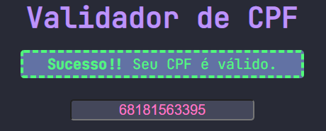
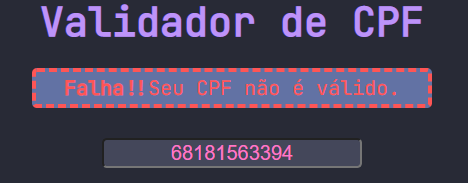

# Validador de CPF utilizando JavaScript

O objetivo desse projeto foi criar um validador de CPF utilizando a lógica em JavaScript.

## Tecnologias utilizadas

- HTML.
  
- CSS.
  
- JavaScript.
  
## Preview do projeto

## Como testar o projeto

### Clone o repositório e abra remotamente

Digite no seu terminal

``
git clone https://github.com/guilhermag/validador-cpf.git
``

``
cd validador-cpf/
``

Agora é só abrir o ``index.html``.

## Créditos

Desenvolvido por Guilherme de Araujo Gabriel.